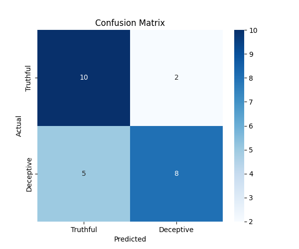
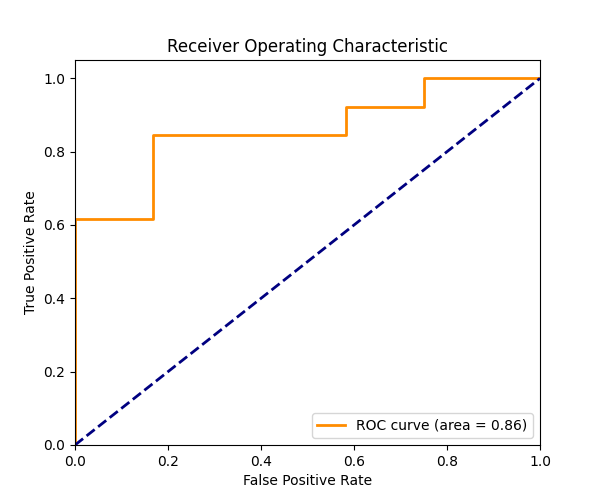

# Multimodal Deception Detection

A deep learning project that detects whether a person is lying or telling the truth by analyzing both **video (facial expressions)** and **text (transcripts)** simultaneously. 

🌐 **[Try the Live Web App Here](https://whyamanbhardwaj-truelies.hf.space/)**

---

## 📖 Project Overview
Deception detection is a highly complex task. Human accuracy at detecting lies is typically around 54% (slightly better than random chance). This project utilizes a **State-of-the-Art (SOTA) Multimodal AI** approach to achieve **80% validation accuracy** on the *Real-life Deception Detection 2016* dataset.

Users can upload a short video clip along with a text transcript of what is being said. The model processes both streams of data, fuses them using cross-attention, and outputs a prediction (Truthful or Deceptive) with a confidence percentage.

## 🧠 Model Architecture
This model does not just look at images or read text independently; it learns how they interact. 

1. **Text Stream (What is said):** Uses **DistilBERT** (`distilbert-base-uncased`) to extract semantic meaning from the transcript.
2. **Video Stream (How it is said):** Extracts frames from the video and passes them through a **Vision Transformer (ViT)** (`vit-base-patch16-224-in21k`). The spatial features are then fed into an **LSTM** network to capture the *temporal dynamics* (movement and changes over time).
3. **Cross-Attention Fusion:** Uses Multi-Head Attention where the Text acts as the "Query" and the Video acts as the "Key/Value" memory. This allows the model to look at specific facial expressions that correspond to specific spoken words.
4. **Classification Head:** A heavily regularized dense network outputs the final Truthful/Deceptive probabilities.

## 📊 Results & Performance
The model was trained on dual T4 GPUs and achieved a peak Validation Accuracy of **80%**. 

*(Note: Create an `images/` folder in your repository and upload the graphs generated by the notebook to display them below).*

### Training & Validation Curves
> *The graph below shows the loss and accuracy over 20 epochs. The model hits its optimal generalization around Epoch 8-12 before overfitting begins.*

### Confusion Matrix
> *Visualizes True Positives, True Negatives, False Positives, and False Negatives.*

### ROC Curve
> *Receiver Operating Characteristic curve demonstrating the model's diagnostic ability across different thresholds.*

## 📂 Repository Structure
* `notebook.ipynb`: The complete end-to-end training pipeline, including data loading, model definition, training loop, and visualization outputs.
* `images/`: Directory containing the performance graphs generated during training.

>The model is available at: 

## 🗄️ Dataset

Trained on the **Real-life Trial Data for Deception Detection (2016)** dataset, which consists of real court trial videos categorized into deceptive and truthful statements.
